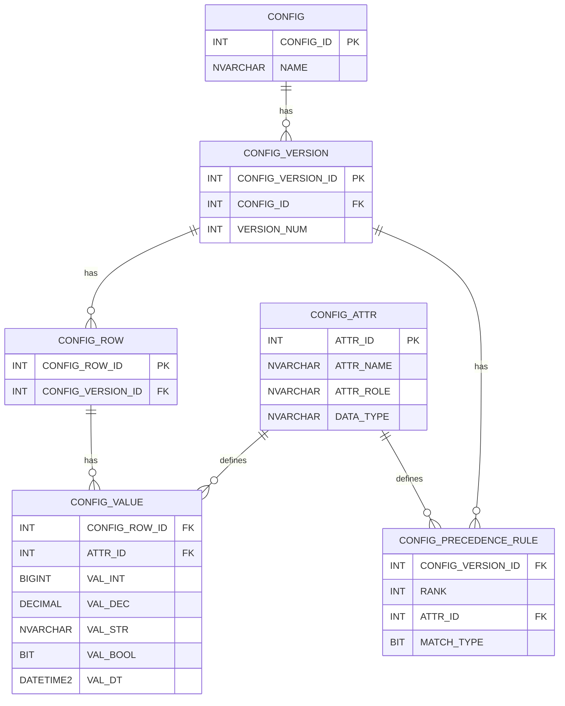

# precedence_config
Dynamic configurations similar to Entity Value Attribute (EAV)

## Goal
Dynamically match data between a config table and a fact table specifying the match level by a rank(precede table)

# Tables
```
CONFIG - 
CONFIGS_VERSION – versioned configuration.
CONFIG_VALUE –
CONFIG_ATTR – catalog of allowed attribute names.
CONFIG_ROW
CONFIG_PRECEDENCE_RULES – precedence per config and attribute (0/1 by rank).
```




# List of configs
Supports multiple config versions to allow for swapping in and out configurations
```SQL
CREATE TABLE dbo.CONFIG (
    CONFIG_ID   INT IDENTITY(1,1) NOT NULL PRIMARY KEY,
    NAME        NVARCHAR(128) NOT NULL UNIQUE
);
```

# List of configs
Supports multiple config versions to allow for swapping in and out configurations
```SQL
CREATE TABLE dbo.CONFIG_VERSION (
    CONFIG_VERSION_ID INT IDENTITY(1,1) NOT NULL PRIMARY KEY,
    CONFIG_ID         INT NOT NULL,
    VERSION_NUM       INT NOT NULL,
    CONSTRAINT UQ_CONFIG_VERSION UNIQUE (CONFIG_ID, VERSION_NUM),
    CONSTRAINT FK_CONFIG_VERSION__CONFIG
        FOREIGN KEY (CONFIG_ID) REFERENCES dbo.CONFIG(CONFIG_ID)
);
```

# Config Attributes table
Allowed attributes/params; role distinguishes match keys vs output params
- Param "Config Value"
- Match "Column name"
```SQL 

CREATE TABLE dbo.CONFIG_ATTR (
    ATTR_ID     INT IDENTITY(1,1) NOT NULL PRIMARY KEY,
    ATTR_NAME   NVARCHAR(128) NOT NULL UNIQUE,
    ATTR_ROLE      NVARCHAR(10) NOT NULL          -- 'match' or 'param'
        CHECK (ROLE IN ('match','param')),
    DATA_TYPE   NVARCHAR(25)  NOT NULL
        CHECK (DATA_TYPE IN ('int','dec','str','bool','dt'))
);

```
# Config Row Table
Stores the row key for the value data as many values are in 1 row
```SQL
CREATE TABLE dbo.CONFIG_ROW (
    CONFIG_ROW_ID           INT IDENTITY(1,1) NOT NULL PRIMARY KEY,
    CONFIG_VERSION_ID  INT NOT NULL,
    CONSTRAINT FK_CONFIG_ROW__VERSION
    FOREIGN KEY (CONFIG_VERSION_ID) REFERENCES dbo.CONFIG_VERSION(CONFIG_VERSION_ID)
);

```


# Config Value Table
typed value store of all configurations
```SQL
CREATE TABLE dbo.CONFIG_VALUE (
    CONFIG_VALUE_ID     INT IDENTITY(1,1) NOT NULL PRIMARY KEY,
    CONFIG_ROW_ID  INT NOT NULL,                  -- which config pattern (row)
    ATTR_ID   INT NOT NULL,                  -- which attribute name
    
    
    -- typed storage (only one non-null allowed for param; 0 or 1 for match)
    VAL_INT   BIGINT NULL,
    VAL_DEC   DECIMAL(38,10) NULL,
    VAL_STR   NVARCHAR(2048) NULL,
    VAL_BOOL  BIT NULL,
    VAL_DT    DATETIME2 NULL,
    
    CONSTRAINT PK_CONFIG_VALUE PRIMARY KEY (CONFIG_ROW_ID, ATTR_ID, ROLE),
    CONSTRAINT FK_VALUE__MATCH FOREIGN KEY (CONFIG_ROW_ID) REFERENCES dbo.CONFIG_ROW(CONFIG_ROW_ID),
    CONSTRAINT FK_VALUE__ATTR  FOREIGN KEY (ATTR_ID)  REFERENCES dbo.CONFIG_ATTR(ATTR_ID),
    
    -- Enforce cardinality:
    --   params: exactly 1 typed value
    CONSTRAINT CK_CONFIG_PARAMS_ONE_VALUE CHECK (
      (CASE WHEN int_val IS NOT NULL THEN 1 ELSE 0 END) +
      (CASE WHEN dec_val IS NOT NULL THEN 1 ELSE 0 END) +
      (CASE WHEN str_val IS NOT NULL THEN 1 ELSE 0 END) +
      (CASE WHEN bool_val IS NOT NULL THEN 1 ELSE 0 END) +
      (CASE WHEN dt_val IS NOT NULL THEN 1 ELSE 0 END) = 1
    )
);
```

# Precidence (Rank) Rules table
```SQL

CREATE TABLE dbo.CONFIG_PRECEDENCE_RULE (
    CONFIG_VERSION_ID INT NOT NULL,
    RANK              INT NOT NULL CHECK (RANK >= 1),
    ATTR_ID           INT NOT NULL,            -- match attribute
    MATCH_TYPE     BIT NOT NULL,            -- 1 = must match, 0 = must be wildcard
    
    CONSTRAINT PK_CONFIG_PRECEDENCE_RULE PRIMARY KEY (CONFIG_VERSION_ID, RANK, ATTR_ID),
    CONSTRAINT FK_RULE__VERSION FOREIGN KEY (CONFIG_VERSION_ID) REFERENCES dbo.CONFIG_VERSION(CONFIG_VERSION_ID),
    CONSTRAINT FK_RULE__ATTR    FOREIGN KEY (ATTR_ID)           REFERENCES dbo.CONFIG_ATTR(ATTR_ID)
);
```

# INDEXS
```SQL
CREATE INDEX IX_CONFIG_ROW__VERSION           ON dbo.CONFIG_ROW(CONFIG_VERSION_ID);
CREATE INDEX IX_CONFIG_VALUE__ROLE_ATTR         ON dbo.CONFIG_VALUE(ROLE, ATTR_ID, CONFIG_ROW_ID);
CREATE INDEX IX_CONFIG_VALUE__MATCH             ON dbo.CONFIG_VALUE(CONFIG_ROW_ID);
CREATE INDEX IX_RULE__VER_RANK                  ON dbo.CONFIG_PRECEDENCE_RULE(CONFIG_VERSION_ID, RANK);
```
## Example: Flatten config
### Config Table
An end user configures the config table like so.
The end user wants to bring in the value column based on a match, but sometimes there could be multiple matches
A Precedence(Ranking) table is needed to state which match should be selected first

|  col 1   |  col 2  |  col 3  | Value |
| -------- | ------- | ------- |-------|
|  MATCH   | MATCH   | MATCH   | 2     |
|  ALL     | MATCH   | MATCH   | 3     |
|  ALL     | ALL     | MATCH   | 4     |
|  ALL     | ALL     | ALL     | 5     |

### Precedence (Rank) Table
1 means a direct match, a 0 means wild card match
The table is validated by checking:
```RUST ignore
let row_count = 6;
let col_count = 3;

/// (6 = 6)
assert!(row_count = col_count(col_count+1) / 2);
```
6 = 6 which is true!
Learn more about triangle numbers here: https://en.wikipedia.org/wiki/Triangular_number

|  col 1   |  col 2  |  col 3  | RANK |
| -------- | ------- | ------- |------|
|  MATCH   | MATCH   | MATCH   | 1    |
|  ALL     | MATCH   | MATCH   | 2    |
|  ALL     | ALL     | MATCH   | 3    | 
|  MATCH   | ALL     | ALL     | 4    |
|  ALL     | MATCH   | ALL     | 5    |
|  ALL     | ALL     | ALL     | 6    |

### Loading the tables
#### The sql backed tables are serial (Tall) tables, and thus the data needs to be serialized
The Following format was selected for loading the sql tables

# Full Example:
```JSON
{
  "config_id": 1,
  "name": "Test: Scenario 1",
  "version": 1,
  "updated_by": "name",
  "update_date": "2025-08-22T14:00:00Z",
  "configs": [
    {
      "name": "pricing_config",
      "rows": [
        {
          "match": [
            { "key": "customer", "type": "str", "value": "ALL" },
            { "key": "state", "type": "str", "value": "AZ" },
            { "key": "ranked", "type": "int", "value": 3 }
          ],
          "params": [
            { "key": "discount_pct", "type": "dec", "value": "0.125" },
            { "key": "max_orders_day", "type": "int", "value": 250 },
            { "key": "active", "type": "bool", "value": true },
            { "key": "effective_start", "type": "dt", "value": "2025-08-22T00:00:00Z" },
            { "key": "notes", "type": "str", "value": "promo window" }
          ]
        },
        {
          "match": [
            { "key": "customer", "type": "str", "value": "ACME" },
            { "key": "state", "type": "str", "value": "AZ" },
            { "key": "ranked", "type": "int", "value": 3 }
          ],
          "params": [
            { "key": "discount_pct", "type": "dec", "value": "0.150" }
          ]
        }
      ],
      "precedence_rank": [
        { "rank": 1, "customer": 1, "state": 1, "ranked": 1 },
        { "rank": 2, "customer": 0, "state": 1, "ranked": 1 },
        { "rank": 3, "customer": 0, "state": 0, "ranked": 1 },
        { "rank": 4, "customer": 0, "state": 1, "ranked": 0 },
        { "rank": 5, "customer": 1, "state": 0, "ranked": 1 },
        { "rank": 6, "customer": 0, "state": 0, "ranked": 0 }
      ]
    }
  ]
}
```
